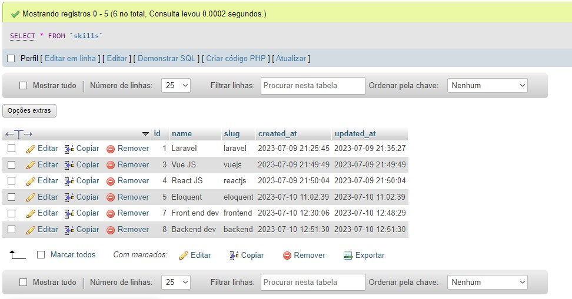

    
    

## Rest-Api em Laravel e Vue

O projeto foi desenvolvido para fins de estudo e me auxiliou bastante na prática do PHP e do framework Laravel, assim como a integração com o ambiente de frontend Vue. Por meio da interface, o usuário consegue criar uma tabela de `skills`, com identificadores únicos; assim como editá-lo e o deletar da base de dados.

## Tecnologias utilizadas

No backend foram utilizados:
 - PHP/Laravel
 - Banco de dados MySQL - manipulação por Eloquent
 - Postman

No front end:
 - Vue JS + Vite
 - Tailwind CSS

O banco de dados do projeto foi acessado e conectador por meio do painel do PHP My Admin

